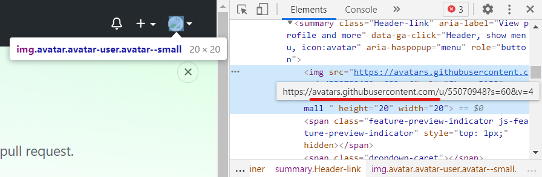

*我参考了这个：[Github图片出不来终极解决方案](https://www.jianshu.com/p/45b2bf8fcb9e)*  

简单来说分为以下几步(我用win10的系统)：  
1. 在`C:\Windows\System32\drivers\etc`目录下找到`HOST`文件，用记事本打开
2. 在里面加入以下代码
    ```
    # GitHub Start 
    140.82.114.4      github.com 
    140.82.114.4      gist.github.com
    185.199.108.153   assets-cdn.github.com
    199.232.96.133    raw.githubusercontent.com
    199.232.96.133    gist.githubusercontent.com
    199.232.96.133    cloud.githubusercontent.com
    199.232.96.133    camo.githubusercontent.com
    199.232.96.133    avatars.githubusercontent.com
    199.232.96.133    avatars0.githubusercontent.com
    199.232.96.133    avatars1.githubusercontent.com
    199.232.96.133    avatars2.githubusercontent.com
    199.232.96.133    avatars3.githubusercontent.com
    199.232.96.133    avatars4.githubusercontent.com
    199.232.96.133    avatars5.githubusercontent.com
    199.232.96.133    avatars6.githubusercontent.com
    199.232.96.133    avatars7.githubusercontent.com
    199.232.96.133    avatars8.githubusercontent.com

    # GitHub End
    ```  
3. 打开[IPAddress.com](https://www.ipaddress.com/)，查找以上提到的域名，对比IP地址，相同就不用管了，不同就换掉。  
   
4. 如果还有加载不出的图片，按<kbd>Ctrl</kbd>+<kbd>Shift</kbd>+<kbd>I</kbd>，或在页面上右键，选择<kbd>检查</kbd>；  
   弹出菜单后，按<kbd>Ctrl</kbd>+<kbd>Shift</kbd>+<kbd>C</kbd>或点击右上角的选择元素按钮，之后点击显示失败的图片，找到图片链接(`https`到`.com`的部分，如`https://avatars.githubusercontent.com`)，复制下来找到IP，再按照第二步里代码的格式添加到`HOST`里即可。  
     
     

*突然想到，虽然放了图，但是加载不出来的人看不见图...XD*