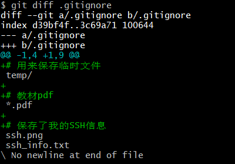
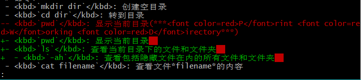
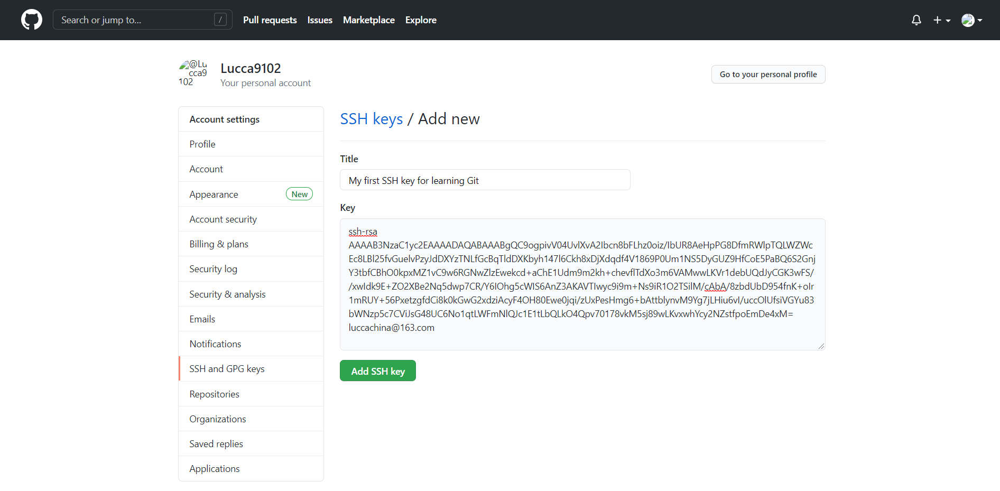
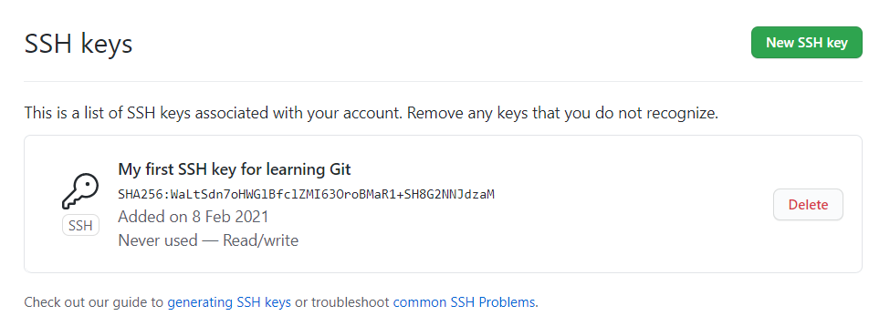
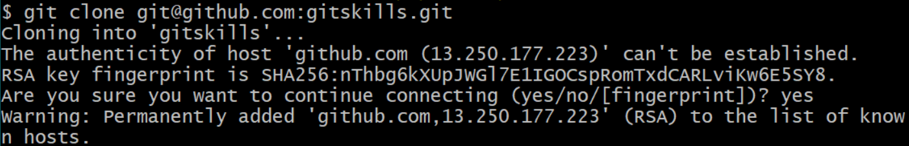
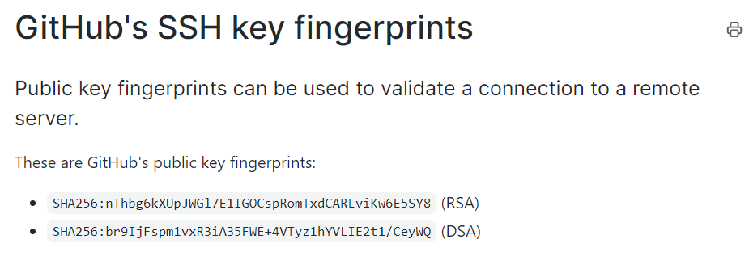
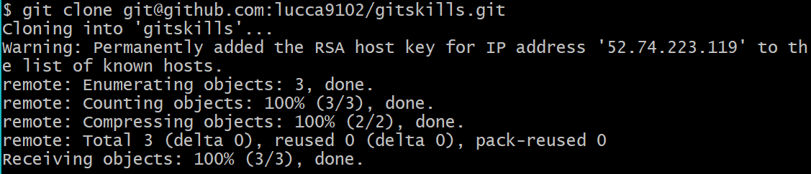

*本文为[廖雪峰老师网站Git教程](https://www.liaoxuefeng.com/wiki/896043488029600)的学习笔记，部分内容结合个人理解添加*

# [Git简介](https://www.liaoxuefeng.com/wiki/896043488029600/896067008724000)
> **世界上最先进的分布式版本控制系统**

---
## [Git的诞生](https://www.liaoxuefeng.com/wiki/896043488029600/896202815778784)
***Linus***用两个礼拜，就用 ***C*** 写出了 ***Git*** 。

---
## [集中式 VS 分布式](https://www.liaoxuefeng.com/wiki/896043488029600/896202780297248)
- 集中式
  例如 ***CVS*** 和 ***SVN*** 。集中式版本控制系统把版本库集中存放在中央服务器。很依赖网络。
- 分布式
  每个人都有自己的版本库。中央服务器只是为了方便交换而存在，没有网络并不会严重影响工作。

---
## [安装Git](https://www.liaoxuefeng.com/wiki/896043488029600/896067074338496)
**略略略**

---
## [创建版本库](https://www.liaoxuefeng.com/wiki/896043488029600/896827951938304)
### 一. 创建
**我**用Git Bash比较顺手，所以下面的介绍都是**Git Bash**的  
流程：
1. 首先选一个喜欢的目录，比如`C:/user/yourname/learngit`之类的。尽量不要在路径中出现中文，避免出现不必要的麻烦。  
2. 打开Git Bash，切换工作路径到选好的位置，有两种方法:  
   1. 在文件资源管理器中打开选好的文件夹，在里面点击右键，菜单里出现一个`Git Bash Here`，选他，工作路径就自动在选好的位置了。
   2. 打开`Git Bash`，使用`cd C:/user/yourname/learngit`命令即可。（如果用Git CMD的话，切换到不同盘符下的路径需要用`cd /D path`，固定搭配，具体操作可以查一下表。

    不放心的话可以用`pwd`(***Print Working Directory***)命令查看当前的目录。
3. 输入`git init`命令，仓库就创建好了。用`ls -ah`命令查看，可以发现目录下多出了一个`.git`文件夹，这个文件夹就是跟踪管理版本库的。不要乱动这个文件夹里的东西，否则可能会破坏版本库。  

*选定的目录不需要是空的，但是不建议初学时使用有重要文件的文件夹，否则后果自负*

### 二. 向版本库添加文件
*版本控制系统只能跟踪文本文件的改动，比如txt文件和代码等。而对于二进制文件，如图片、视频甚至word文件等，系统只能知道有改动，不能确定改动的内容。*  
1. 在上述创建的**Git仓库所在目录**下添加文件
2. 使用命令`git add [file]`，把文件添加到暂存区(关于暂存区的概念会在后面提到，不理解可以先向后翻看)
3. 使用命令`git commit -m ["descriptive message"]`把文件提交到仓库，此次提交的说明就是`-m`后面的字符串

有两点提示：  
1. 如果向工作区添加了新文件，则在`commit`前必须`add`，不然新文件不会被提交。  
2. 如果没有新文件，可以使用`git commit -am`命令，就相当于先`add`再`commit -m`。（`-a`即把当前所有修改了的文件添加到暂存）  
3. 一次`commit`前可以多次`add`，`add`够了再`commit`也可以。

---
---
# [时光穿梭机](https://www.liaoxuefeng.com/wiki/896043488029600/896954074659008)
接下来介绍如何在版本间进行切换。在这之前我们要了解如何查看修改：  
- 当我们修改了工作区的文件，可以使用`git status`命令查看：  
    
  图片中红字的部分就是已修改但没有`add`的文件。  
  如果想要查看修改的内容，就使用`git diff [file]`命令：  
    
  结果中前面有减号，红色的部分为删减部分；前面有加号，绿色的为新增的部分。  
  **如果修改过多，可能出现缩略显示的情况，即在Bash窗口最下部显示一个半角冒号`:`，这时按上下键可以翻看全部内容；不想看可以按`ｑ`结束*  
    

- 如果已经`add`过，可以使用`git diff --staged`查看`add`时与最后一次提交之间做出修改。这里不再贴图。  
  将修改`add`到暂存区后，再查看`git status`，结果如图：  
    

- 提交后，`git status`：  
    
  可以看到这时显示工作目录是干净的(working tree clean)，没有要提交的修改。

---
## [版本回退](https://www.liaoxuefeng.com/wiki/896043488029600/897013573512192)
1. 使用`git log`，查看历史提交记录。  
  例如：  
    
  其中<b><i>`478fe7...`</i></b>和<b><i>`5585b10...`</i></b>是<kbd>**`commit id`**</kbd>(版本号)  
  如果决定输出太长，不方便查看，可以使用`git log --pretty=oneline`，这样提交信息会被缩减到一行内显示。  
    
  这样，我们就得到了每次提交的版本号和相应的提示信息。  
  *提醒一下，Git的版本号不是递增的数字，而是一个SHA1计算出来的非常大的十六进制数字。这样可以更好地适应多人在同一个版本库里工作的情况。*  
2. 获得版本号后，即可用`git reset --hard HEAD^`回退到上一个提交的版本。`HEAD`表示的是当前的版本，每加一个`^`就表示向前一个版本。如果版本相差太远，比如100个版本，也可以用`HEAD~100`来表示。当然，`HEAD`也可以换成上面提到的版本号。  
*这里的`--hard`会使文件退回到选定的版本，未保存的修改将丢失*  
如果不慎选错了版本，也有办法补救。Git的版本回退仅仅是将`HEAD`指针指向这个版本，并更新工作区文件。所以再次`reset`到原来想要的版本号即可。  
  
  
如果不记得版本号，就用`git reflog`命令查看命令记录，包括`reset`和`commit`等。  
  
图中前面的黄字部分就是操作时版本号的一部分，用它们`reset`即可。

---
## [工作区和暂存区](https://www.liaoxuefeng.com/wiki/896043488029600/897271968352576)
- **工作区**  
  在电脑中能够看到的目录，如我使用的的Git文件夹
- **版本库**  
  工作区中有一个隐藏目录<kbd>`.git`</kbd>，这个文件夹就是Git的版本库。版本库中最重要的东西就是称为 ***`stage`*** (或叫 ***`index`*** )的暂存区，还有Git自动创建的第一个分支<kbd>`master`</kbd>，以及指向<kbd>`master`</kbd>的指针<kbd>`HEAD`</kbd>  
  使用`git add`时，会将文件修改添加到暂存区；  
  使用`git commit`时，则会把暂存区的内容提交到当前分支。  
    

---
## [管理修改](https://www.liaoxuefeng.com/wiki/896043488029600/897884457270432)
Git管理的是**修改**，而不是文件。即使增删几个字符也算修改。  
提交文件前必须先添加到暂存区，再提交到版本库。如果没有`add`或`commit -a`，则修改不会被提交。这时用`git status`查看，还会显示有改动但没提交的文件。如果不理解可以动动手，动动脑，做一做这个实验。

---
## [撤销修改](https://www.liaoxuefeng.com/wiki/896043488029600/897889638509536)
如果做出了不符合预期或错误的修改，想要撤销，需要分为以下几种情况讨论：
1. 只做出了修改，没有添加到版本库  
  <s>如果没太大改动就撤销吧，<kbd>Ctrl</kbd>+<kbd>Z</kbd>挺好使的</s>  
  如果改得稀烂，比如我侄子来敲我的键盘，或者猴子们来我的电脑上仿写莎士比亚，那就需要Git来帮忙了。  
  我向Git许愿，Git说，彳亍！然后留下了一串神秘代码:  
  ***`git checkout -- [file]`***  
  `checkout`命令会丢弃工作区的修改，把文件恢复到最后一次添加到版本库时的状态，即最后一次`add`或`commit`时的样子。  
  *注意: 里面的<kbd>`--`</kbd>不能丢，否则会变成另一个命令*  
2. 已经将修改`add`到了暂存库，但没有`commit`  
   1. 使用`git reset HEAD [file]`命令，把暂存区的修改**撤销(*unstage*)**，重新放回工作区。
   2. `git restore --staged <file>`，作用和`reset`一样，不过文件名是必要的。全部恢复时就使用`git restore --staged .` 即可，<kbd>`.`</kbd>就表示全部文件。(不过restore这个命令我不太熟悉，使用前建议查表)
3. 已经`commit`，但是没有推送到远程仓库  
  还有救，按照[版本回退](#reset)一节的方法可以`reset`回来。
4. 已经推送到远程仓库  
  **救不了了，等着被制裁吧**

---
## [删除文件](https://www.liaoxuefeng.com/wiki/896043488029600/900002180232448)
1. 直接在资源管理器删除  
  直接删除或使用Linux命令`rm [file]`(别问Windows命令，我也不会)。这样删除会导致版本库和工作区的不一致，这时有两个选择：  
   1. 误删  
    从版本库恢复文件(如果没提交过就拉倒了)，使用`git checkout -- [file]`即可。  
    当然，误删的文件可以恢复，但是会**丢失最近一次添加到版本库后的更改**。因此删文件要谨慎！ 
   2. 我要删我要删！  
    那就需要在版本库里也删除文件。详见下一条。
2. 在版本库中删除文件  
   <s>使用`rm -rf`命令</s> **(千万不要尝试！)**  
   使用`git rm [file]`命令，会同时删除工作区的文件和版本库的文件。

---

# 命令:
- `$` <kbd>`mkdir dir`</kbd>: 创建空目录  
- `$` <kbd>`cd dir`</kbd>: 转到目录  
- `$` <kbd>`pwd`</kbd>: 显示当前目录  
- `$` <kbd>`ls`</kbd>: 查看当前目录下的文件和文件夹  
  - `$` <kbd>`ls -ah`</kbd>: 查看包括隐藏文件在内的所有文件和文件夹  
- `$` <kbd>`cat filename`</kbd>: 查看文件*filename*的内容
- `$` <kbd>`git init`</kbd>: 把这个目录编程Git可以管理的仓库
- `$` <kbd>`git add`</kbd>: 把文件添加到仓库
- `$` <kbd>`git commit`</kbd>
  - `$` <kbd>`git commit -m "xxx"`</kbd>: 把文件提交到仓库
  - `$` <kbd>`git commit -am "xxx"`</kbd>: 把所有已修改的文件提交到仓库
- `$` <kbd>`git status`</kbd>: 查看仓库的当前状态
- `$` <kbd>`git diff`</kbd>: 查看修改前后的不同  
  - `$` <kbd>`git diff version -- filename`</kbd>: 查看<i>`version`</i>版本与当前状态的差别。(`version`可以是版本号也可以是`HEAD`表示的编号)
- `$` <kbd>`git log`</kbd>: 查看历史提交记录
  - <kbd>`--pretty=oneline`</kbd>: 将简略信息在一行内显示出来
- `$` <kbd>`git reflog`</kbd>: 查看命令历史(包括`commit`、`reset`等等)  

## 

## 撤销更改
- `$` <kbd>`git checkout -- filename`</kbd>: 将*filename*恢复到最近一次`add`或`commit`的状态。
  - 注意: 恢复的部分只包括<u>已保存</u>，<u>未提交</u>，<u>未放入暂存区</u>的修改。另外，命令中的<b>`--`</b>是必要的，否则会变成另一个命令。
- `$` <kbd>`git reset`</kbd>: 回退版本
  - <kbd>`--hard HEAD`</kbd>: 退回当前(最后一次提交的)版本并删除修改。
    - 这里的<kbd>`HEAD`</kbd>表示当前版本，类似的，<kbd>`HEAD^`</kbd>表示上一个版本，<kbd>`HEAD^^`</kbd>表示上上一个版本。上100个版本可以写成<kbd>`HEAD~100`</kbd>。
  - <kbd>`HEAD <file>`</kbd>: 将暂存区的修改撤销(unstage)掉，重新放回工作区。不会删除当前的修改。
  - <kbd>*`commit id`*</kbd>: 回退到该版本号对应的版本

## 删除文件
- `$` <kbd>`git rm filename`</kbd>: 在版本库中删除文件。  
  - 如果直接在资源管理器中删除文件(例如: `rm filename`)，会导致工作区和版本库不一致。这时的选择有：  
    1. 要删，在版本库删除文件<s>，再您的见</s>
    2. 误删，从版本库恢复文件(如果没提交过就拉倒了)。当然，误删的文件可以恢复，但是会丢失最近一次提交后的更改。因此删文件要谨慎！  
    > 在这里提个醒，版本库包括暂存区和分支哦，不清楚建议在下面概念那部分看一下

  - 如果使用`git rm`命令删除，则文件会同时在版本库和文件资源管理器中被删除，好像也不会进入回收站。

## 远程仓库
### 添加SSH Key
1. 设置SSH key:
   在Git Bash中输入命令: <kbd>`ssh-keygen -t rsa -C "email@example.com`</kbd>，个人使用时一路回车即可(因为没有太高的保密需求)。我生成的第一个SSH key位于`C://Users/Lucca/.ssh`目录下。需要注意的是，生成的两个文件分别名为`id_rsa`和`id_rsa.pub`。其中`id_rsa`为私钥，不要泄露给别人；`id_rsa.pub`为公钥，就随便了。
2. 登录GitHub，打开"Account Settings"中的"SSH Keys"界面，然后点击"Add SSH Key"，Title自拟<s>，正文不少于800字</s>，在Key栏粘贴`id_rsa.pub`文件的内容(用记事本打开即可)。  
   
   添加后即可在页面看到
   

- **注意**：在GitHub上免费托管的仓库是公开的，但只有自己能够修改。如果想自己雪藏仓库，可以成为GitHub的付费用户，享受私人仓库；或者自己建立一个Git服务器。

### 添加远程库
1. 建立远程库
   在GitHub上创建一个新的repo(自己找吧！)，然后给仓库起个名字，比如我的是`Learning-Git`。其他保持默认，创建仓库即可。
   现在这个仓库是空的，我们可以从这个仓库克隆出新仓库，也可以把一个已有的本地仓库与之关联，然后把本地仓库的内容推送到GitHub仓库。
2. 关联远程库  
   在Git Bash中输入命令`git remote add origin git@github.com:Lucca9102/Learning-Git`，把仓库关联到GitHub远程仓库。添加后，远程库就叫`origin`。
3. 把本地内容推送到远程
   使用<kbd>`git push`</kbd>命令，实际上就是把当前的分支`master`推送到远程。
   第一次推送时，远程库是空的。使用使用`-u`参数，即`git push -u origin master`。这样Git不但会把本地的`master`分支内容推送到远程新的`master`分支，还会把本地的`master`分支和远程`master`分支关联起来。在以后的推送或者拉取时就可以简化命令，使用`git push origin master`即可。  
   第一次使用Git的`clone`或`push`命令连接GitHub时，会得到警告。警告大意就是要确认GitHub的Key的指纹信息是否真的来自GitHub的服务器。如果不放心可以和[GitHub的RSA Key的指纹信息](https://docs.github.com/en/github/authenticating-to-github/githubs-ssh-key-fingerprints)对照一下，然后输入`yes`回车即可。之后GitHub的Key就会被添加到信任列表，不会再有警告了。
   
   

### 从远程库克隆
在想要克隆远程库的目录下打开Git Bash，有多种方法可以克隆仓库。下面根据其他同学(?)的笔记介绍两种方法：  
1. git(SSH协议) -> 默认，最快  
   `git clone git@github.com:lucca9102/Learning-Git.git`
2. https -> 慢，每次都要输口令；不支持https就不能用  
   `git clone https://github.com/lucca9102/Learning-Git.git`

克隆成功后效果如图：

## 分支管理

---
---
# 概念：
- 工作区：在电脑中能够看到的目录，如当前的Git文件夹
- 版本库：工作区中有一个隐藏目录<kbd>`.git`</kbd>，这个文件夹就是Git的版本库。版本库中最重要的东西就是称为<i>**stage**</i>(或叫<i>**index**</i>)的暂存区，还有Git自动创建的第一个分支<kbd>`master`</kbd>，以及指向<kbd>`master`</kbd>的指针<kbd>`HEAD`</kbd>
使用`git add`时，会将文件修改添加到暂存区；
使用`git commit`时，则会把暂存区的内容提交到当前分支。
- Git管理的是修改，而不是文件。即使新增一行也算修改。提交文件前必须先添加到暂存区，再提交到版本库。如果没有`add`，则修改不会被提交
